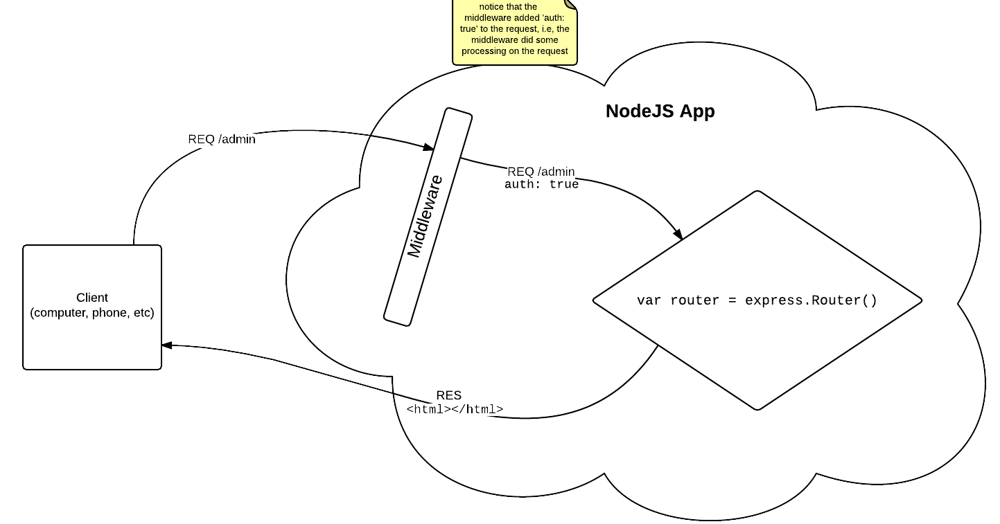

The `middleware` Directory
==========================

This directory serves to hold/organize any custom middleware that your app uses.

The middleware pattern can be understood within context of the request/response pattern:



The purpose of middleware is to do some processing to the incoming request. In the above example, the middleware did some checks to make sure that the user that generated the request was authorized to be there. This can be seen by the `{auth: true}` property that was added to the request. Now, the rest of the app can expect a property to exist on the `req` variable called `req.auth` and can use that Boolean to easily check if the request is authenticated. This follows the principle of each 'function doing one thing and doing it well' as well as modularity.

You can also use middleware to change HTTP headers and bounce things back to the client (like a 401, unauthorized) before it even gets to the router.

A typical middleware file looks something like:

```javascript
module.exports = function() {

    // Here you can require any module you need. This
    // may be a node module or maybe a mongoose model
    // that you have created in your `app/models` dir
    var a = require('a');

    // This is the middleware part, notice that 
    // it has the parameters `req`, `res`, and `next`.
    // All three of these are very important, as seen below
    return function(req, res, next) {

        // Inspect the incoming request to see where it's trying to go
        if (req.url === '/admin') {
            var user = basicAuth(req);

            if (!user || !user.hasOwnProperty('name') || !userMatch(user, users)) {
                res.set('WWW-Authenticate', 'Basic realm=""');
                return res.status(401).send();
            } else {
                // Tell the rest of the app that this request is allowed to be here.
                req.auth = true;
            }
        }

        // this function call is important, it tells express to go on to
        // the next middleware function, or to the router. If this wasn't
        // here, the app would hang and the browser would keep waiting
        // for a response
        next();
    }

    // ----------------------------
    // Private Helper Functions
    // ----------------------------
    function userMatch(user, users) {
        // allow everyone in!
        return true;
    };
};
```

This particular middleware file has a function wrapping the middleware function, i.e.:

```javascript
module.exports = function() {
  
    return function(req, res, next) { // ... };

};
```

That means that whenever this middleware is required:

```javascript
var myMiddleware = require('middleware/my-middleware');
```

You will have to actually get that inner-function by calling the `myMiddleware` function so that you can tell your app to use it:

```javascript
var actualMiddleware = myMiddleware();
// actualMiddleware is now the 'function(req, res, next) { // ... };'' from above.

// Tell the app to use it:
app.use(actualMiddleware);
```

This will tell the app to use it on any incoming route. If you wish to limit your middleware to a subset of incoming routes, do:

```javascript
app.use('/subset/of/routes', actualMiddleware);
```

More succintly:

```javascript
var myMiddleware = require('middleware/my-middleware');
app.use(myMiddleware()); // Notice the '()' at the end of myMiddleware
```

Even more compact (as seen in `app.js:46`):

```javascript
app.use(require('middleware/my-middleware')());
```

------------------------

### See Also ###

+ [Using Express Middleware](http://expressjs.com/guide/using-middleware.html)